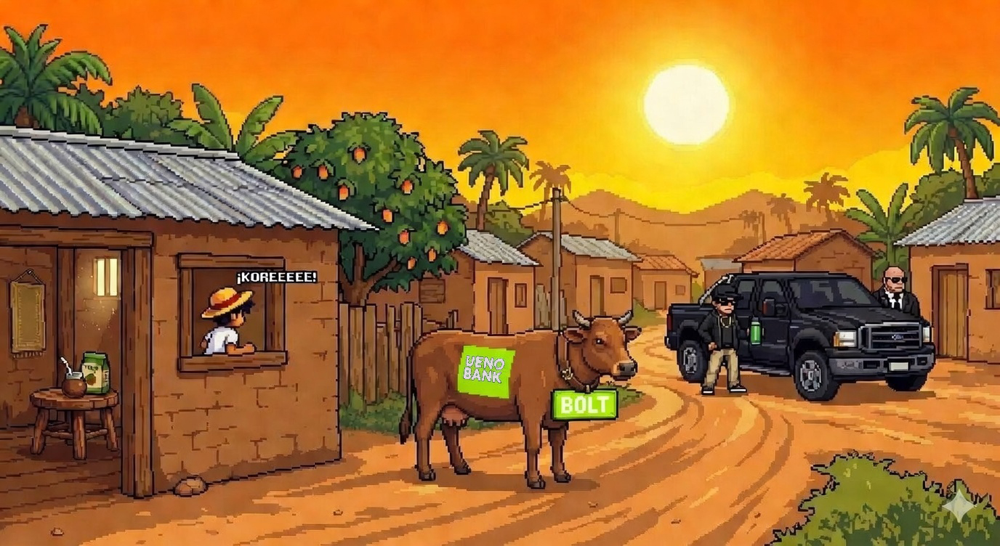

<p align="center">
  
</p>

<h1 align="center">TERERE CORE - La Venganza del Capiateño</h1>

<p align="center">
  <em>Un juego de pelea 2D con identidad paraguaya: recorre las calles de Capiata, San Lorenzo, Luque y Asuncion para recuperar tu terere.</em>
</p>

<p align="center">
  
  
  
  
</p>

---

## Descripcion

**Terere Core** es un beat 'em up 2D desarrollado en Python con Pygame, ambientado en Paraguay. El jugador controla al **capiateño**, un personaje que debe recorrer 4 niveles de pelea contra distintos rivales (chetos) mientras participa en minijuegos entre cada combate. El juego celebra la cultura paraguaya con referencias al terere, la chipa, los yuyos medicinales y la vida cotidiana del interior.

---

## Features

- **4 niveles de combate** con enemigos unicos: Luqueño, Sanlorenzano y Asuncheto, cada uno con sprites y comportamientos propios
- **Sistema de combos** con ataques normales (1x), combos encadenados (1.5x) y ataque especial (3x daño)
- **IA enemiga** con maquina de estados: patrulla, persecucion, ataque y retirada
- **5 minijuegos** entre niveles: Terere Rush, Chipa Rush, Esquiva Cheto, Machete Rush y Yuyos Quiz
- **Sistema de puntaje y highscores** con persistencia en JSON (top 5)
- **Rating por estrellas** al completar el juego (1-3 estrellas segun puntaje)
- **Banda sonora original** con temas unicos por nivel
- **Arte pixel art** con fondos ilustrados de ciudades paraguayas
- **Sistema de fisicas** con gravedad, salto y knockback
- **Menu de pausa** con instrucciones de controles

---

## Tech Stack

| Tecnologia | Uso |
|------------|-----|
| **Python 3.10+** | Lenguaje principal |
| **Pygame 2.6+** | Motor grafico, audio y eventos |
| **JSON** | Configuracion de niveles y persistencia de highscores |
| **Press Start 2P** | Tipografia retro 8-bit |

---

## Instalacion

### Requisitos previos
- Python 3.10 o superior
- pip (gestor de paquetes de Python)

### Pasos

```bash
# 1. Clonar el repositorio
git clone https://github.com/tu-usuario/TERERE-CORE.git
cd TERERE-CORE

# 2. (Opcional) Crear un entorno virtual
python -m venv venv
source venv/bin/activate        # Linux/Mac
venv\Scripts\activate           # Windows

# 3. Instalar dependencias
pip install pygame

# 4. Ejecutar el juego
python tereré-game/main.py
```

---

## Estructura del Proyecto

```
tereré-game/
├── main.py                    # Punto de entrada
├── core/
│   ├── game.py                # Loop principal y configuracion de Pygame
│   ├── settings.py            # Constantes globales (resolucion, colores, fisicas)
│   ├── input_handler.py       # Mapeo de teclado centralizado
│   └── state_manager.py       # Maquina de estados del juego
├── entities/
│   ├── character.py           # Clase base con fisicas y animacion
│   ├── player.py              # Jugador con combos y ataque especial
│   └── enemy.py               # Enemigo con IA (patrulla/persecucion/ataque)
├── states/
│   ├── menu_state.py          # Menu principal con highscores
│   ├── name_state.py          # Entrada de nombre del jugador
│   ├── story_state.py         # Secuencia narrativa
│   ├── select_state.py        # Seleccion de personaje
│   ├── game_state.py          # Gameplay de pelea
│   ├── minigame_state.py      # Wrapper de minijuegos
│   ├── gameover_state.py      # Pantalla de derrota
│   └── victory_state.py       # Pantalla de victoria con estrellas
├── minigames/
│   ├── base_minigame.py       # Clase abstracta base
│   ├── terere_rush.py         # Atrapar guampas de terere
│   ├── chipa_rush.py          # Recolectar chipas desde aviones
│   ├── esquiva_cheto.py       # Esquivar baches y autos en 3 carriles
│   ├── machete_rush.py        # Esquivar machetes cayendo
│   └── yuyos_quiz.py          # Quiz de yerbas medicinales
├── ui/
│   ├── button.py              # Botones interactivos con hover
│   ├── text_renderer.py       # Renderizado de texto retro
│   └── hud.py                 # Barras de vida, puntaje y nivel
├── systems/
│   ├── collision.py           # Deteccion de colisiones
│   └── score.py               # Puntaje y highscores (JSON)
├── levels/
│   ├── level_loader.py        # Cargador de niveles desde JSON
│   ├── level1.json            # Plaza de Capiata
│   ├── level2.json            # Campus de la UNA (San Lorenzo)
│   ├── level3.json            # Barrio de Luque
│   └── level4.json            # Terreno final: Asuncion
└── assets/
    ├── fonts/                 # Press Start 2P (tipografia retro)
    ├── images/
    │   ├── characters/        # Sprites de personajes y enemigos
    │   ├── backgrounds/       # Fondos de niveles y pantallas
    │   └── ui/                # Iconos de minijuegos y HUD
    └── sounds/
        ├── music/             # Musica de fondo por nivel
        └── sfx/               # Efectos de sonido (golpes)
```

---

## Como Jugar

### Controles

| Accion | Teclas |
|--------|--------|
| **Mover** | `← → ↑ ↓` / `W A S D` |
| **Saltar** | `Espacio` / `W` |
| **Atacar** | `Enter` |
| **Ataque Especial** | `J` |
| **Pausa** | `Escape` |

### Flujo del Juego

```
Menu Principal → Nombre → Historia → Nivel 1 → Minijuego → Nivel 2 → Minijuego → Nivel 3 → Minijuego → Nivel 4 (Final) → Victoria
```

### Niveles

| Nivel | Ubicacion | Enemigo | Minijuego |
|-------|-----------|---------|-----------|
| 1 | Plaza de Capiata | Luqueño | Chipa Rush |
| 2 | Campus de la UNA | Sanlorenzano | Esquiva Cheto |
| 3 | Barrio de Luque | Cheto | Machete Rush |
| 4 | Terreno Final: Asuncion | Asuncheto | - (Pelea final) |

### Sistema de Combate

- **Ataque normal:** 15 de daño
- **Combo (2+ golpes seguidos):** 22 de daño (1.5x)
- **Ataque especial (J):** 45 de daño (3x) con cooldown de 1 segundo

### Sistema de Puntaje

- Cada golpe otorga `daño x 10` puntos
- Bonus por completar nivel (300 - 1000 segun dificultad)
- Puntos extra en minijuegos
- **Top 5 highscores** guardados localmente

---

## Arquitectura Tecnica

### Patrones de Diseño

- **State Machine:** Manejo de estados del juego (menu, pelea, minijuego, etc.) con transiciones limpias
- **Template Method:** Clase abstracta `BaseMinigame` define el ciclo de vida de los minijuegos
- **Factory:** `StateManager` instancia estados dinamicamente; `MinigameState` carga minijuegos por nombre
- **Component System:** Sistemas separados de colision, puntaje e input desacoplados de las entidades

### Persistencia de Datos

El sistema de highscores utiliza JSON como almacenamiento local:

```json
{
  "highscores": [
    { "name": "Capiateño", "score": 8500, "date": "2026-03-17" }
  ]
}
```

- Archivo: `data/highscores.json`
- Guarda los **top 5** puntajes con nombre y fecha
- Se actualiza al ganar o perder

---

## Capturas de Pantalla

<!-- Agrega capturas o GIFs del juego aqui -->
<!--  -->

---

## Creditos

- **Desarrollo:** Rodrigo J. Arguello y equipo
- **Arte:** Pixel art original con tematica paraguaya
- **Audio:** Banda sonora original por nivel
- **Motor:** [Pygame](https://www.pygame.org/)
- **Tipografia:** [Press Start 2P](https://fonts.google.com/specimen/Press+Start+2P) (SIL Open Font License)

---

## Licencia

Este proyecto esta bajo la licencia MIT. Ver el archivo `LICENSE` para mas detalles.

---

<p align="center">
  Hecho con terere y codigo desde Paraguay 🧉
</p>
